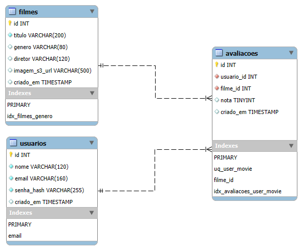

# Projeto Filmes AWS 🎬

### Projeto de conclusão do Curso de Aprofundamento Cloud da Proz+AWS


---

## 🚀 Acessar a Aplicação

A aplicação está no ar e pode ser acessada através do link abaixo:

**[https://projeto-filmes.ddns.net](https://projeto-filmes.ddns.net)**

---

## 📖 Sobre o Projeto

Este é um sistema **full stack** de gerenciamento de filmes, desenvolvido como projeto final do curso de Aprofundamento Cloud. A aplicação permite que usuários se cadastrem, gerenciem um catálogo de filmes, façam avaliações e recebam recomendações personalizadas com base em seus gostos.

O grande diferencial do projeto é a sua arquitetura, totalmente construída sobre serviços da **AWS** e implantada de forma automatizada com um pipeline de **CI/CD**, demonstrando um fluxo de trabalho moderno e escalável.

---

## ✨ Funcionalidades Principais

* **Autenticação de Usuários:** Sistema completo de cadastro e login com tokens **JWT**.
* **Gerenciamento de Filmes (CRUD):** Adicionar, editar e excluir filmes do catálogo.
* **Upload de Imagens na Nuvem:** As imagens de capa dos filmes são enviadas e armazenadas de forma segura no **Amazon S3**.
* **Sistema de Avaliações:** Usuários podem avaliar filmes com notas de 1 a 5 estrelas.
* **Recomendações Personalizadas:** Um algoritmo no backend analisa as avaliações do usuário para sugerir novos filmes.

---

## 🛠️ Tecnologias Utilizadas

#### Frontend

* **React** com **Vite**
* **Tailwind CSS** para estilização
* **Axios** para comunicação com a API

#### Backend

* **Node.js** com **Express**
* **JWT (JSON Web Tokens)** para autenticação
* **MySQL2** como driver do banco de dados

#### Nuvem e DevOps

* **Amazon RDS (MySQL):** Banco de dados relacional gerenciado.
* **Amazon S3:** Armazenamento escalável de objetos para as capas dos filmes.
* **Amazon EC2:** Servidor virtual para hospedar a aplicação.
* **AWS IAM:** Gerenciamento de permissões para acesso seguro aos serviços.
* **Docker:** Conteinerização do frontend e do backend.
* **Nginx:** Servidor web e proxy reverso para o frontend.
* **GitHub Actions:** Automação de build, teste e deploy (CI/CD).
* **Let's Encrypt (Certbot):** Geração de certificados SSL para HTTPS.

---

## ☁️ Arquitetura na Nuvem

A aplicação foi projetada para ser escalável e segura, utilizando os seguintes serviços da AWS:

* **Amazon EC2:** Uma instância `t3.micro` hospeda os containers Docker da aplicação (frontend e backend). O acesso é controlado por um Security Group que libera as portas 22 (SSH), 80 (HTTP) e 443 (HTTPS).
* **Amazon S3:** Um bucket privado (`filmes-app-bucket`) armazena as imagens de capa dos filmes. O acesso a este bucket é feito de forma segura pelo backend através de um usuário IAM com permissões mínimas.
* **Amazon RDS:** Uma instância `db.t4g.micro` com MySQL gerencia todos os dados da aplicação (usuários, filmes, avaliações). O acesso é restrito pelo seu Security Group, que permite conexões apenas da instância EC2.

---

## 🗃️ Modelo do Banco de Dados

O diagrama abaixo representa a estrutura do banco de dados relacional no Amazon RDS, com as tabelas de `usuarios`, `filmes` e a tabela associativa `avaliacoes`.



---

## ⚙️ Executando o Projeto Localmente

1. **Pré-requisitos:**
    * Node.js v20+
    * Docker e Docker Compose

2. **Clone o repositório:**

    ```bash
    git clone https://github.com/MarceloRodrigues1853/projeto_filmes_aws.git
    
    cd projeto_filmes_aws
    ```

3. **Configuração do Backend:**
    * Navegue até a pasta do backend: `cd backend`
    * Crie um arquivo `.env` e preencha com as variáveis de ambiente necessárias.
    * Instale as dependências: `npm install`

4. **Configuração do Frontend:**
    * Navegue até a pasta do frontend: `cd frontend`
    * Crie um arquivo `.env.local` com a seguinte variável:

        ```env
        VITE_API_URL=http://localhost:8080/api
        ```

    * Instale as dependências: `npm install`

5. **Inicie a aplicação com Docker Compose:**

    * Na raiz do projeto, execute:

         `docker compose up --build `

    * O frontend estará acessível em `http://localhost:5173`.
    * O backend estará rodando na porta `8080`.

---

## 🚀 Deploy Automatizado

O deploy é feito automaticamente via **GitHub Actions** toda vez que um `push` é realizado na branch `main`. O workflow realiza os seguintes passos:

1. Faz o build das imagens Docker de produção para o frontend e backend.

2. Envia as imagens para o Docker Hub.

3. Conecta-se via SSH à instância EC2.

4. Executa o `docker compose` no servidor para baixar as novas imagens e reiniciar os serviços.

---
